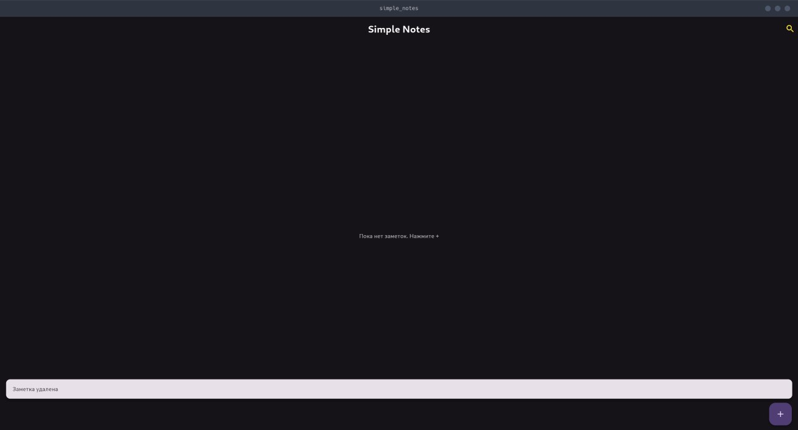
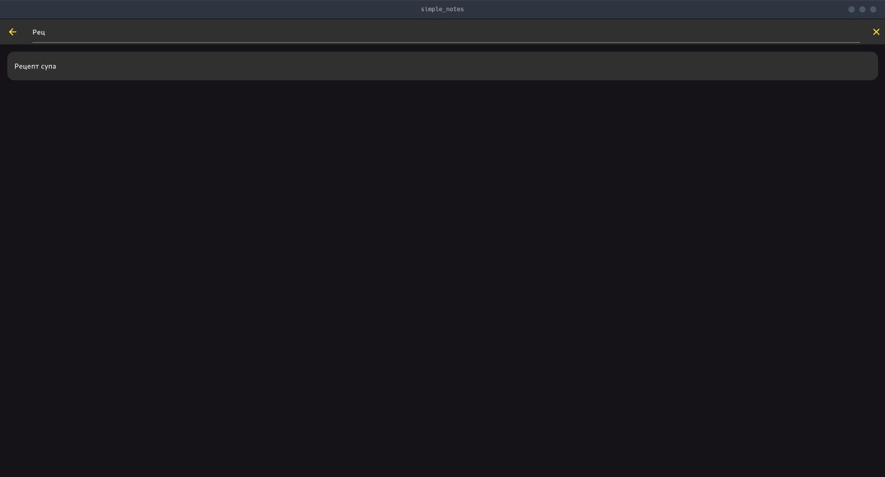
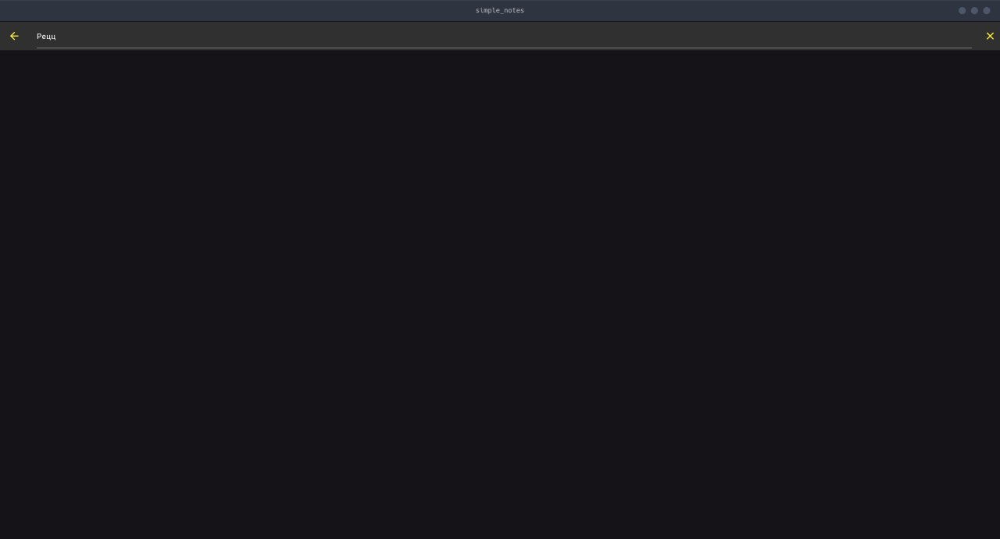

# Отчёт по практическому занятию №5

## Тема: Работа со списками. Передача данных между модулями

| Параметр | Значение |
| :--- | :--- |
| Студент | Устинов Максим |
| Группа | ЭФБО-09-23 |

---

## 1. Цели практического занятия

* Научиться отображать коллекции данных с помощью ListView.builder.
* Освоить базовую навигацию Navigator.push.
* Научиться добавлять, редактировать и удалять элементы списка без внешних пакетов и сложных архитектур.

## 2. Ход работы

Проект Simple Notes разработан как демонстрация работы со списками данных, навигации между экранами и базовых операций CRUD (создание, чтение, обновление, удаление) без использования внешних пакетов для управления состоянием.

### 2.1. Структура проекта

Основная логика приложения сосредоточена в следующих файлах:

- `main.dart`: Главный файл, содержащий виджеты `SimpleNotesApp` (основное приложение) и `NotesPage` (экран со списком заметок), а также логику для добавления, редактирования и удаления заметок.
- `edit_note_page.dart`: Экран для создания и редактирования отдельных заметок.
- `models/note.dart`: Определение модели данных `Note`.

### 2.2. Отображение списка заметок

Список заметок отображается с использованием `ListView.builder` в виджете `NotesPage`. Это позволяет эффективно обрабатывать большие списки, создавая только те элементы, которые видны на экране.

```182:186:simple_notes/lib/main.dart
              : ListView.builder(
                  padding: const EdgeInsets.all(12),
                  itemCount: filtered.length,
                  itemBuilder: (context, i) {
```

### 2.3. Добавление новой заметки

Для добавления новой заметки используется `FloatingActionButton`, который вызывает метод `_addNote`. Этот метод использует `Navigator.push` для открытия `EditNotePage` и ожидает возвращения новой заметки. Если заметка возвращена, она добавляется в список `_notes` и обновляется состояние виджета с помощью `setState`.

```119:126:simple_notes/lib/main.dart
  Future<void> _addNote() async {
    final newNote = await Navigator.push<Note>(
      context,
      MaterialPageRoute(builder: (_) => const EditNotePage()),
    );
    if (newNote != null) {
      setState(() => _notes.add(newNote));
    }
  }
```

### 2.4. Редактирование заметки

Редактирование заметки происходит при тапе на элемент списка. Метод `_edit` также использует `Navigator.push` для открытия `EditNotePage`, передавая существующую заметку для редактирования. После сохранения изменений, обновленная заметка возвращается и заменяет старую в списке.

```129:140:simple_notes/lib/main.dart
  Future<void> _edit(Note note) async {
    final updated = await Navigator.push<Note>(
      context,
      MaterialPageRoute(builder: (_) => EditNotePage(existing: note)),
    );
    if (updated != null) {
      setState(() {
        final i = _notes.indexWhere((n) => n.id == updated.id);
        if (i != -1) _notes[i] = updated;
      });
    }
  }
```

### 2.5. Удаление заметки

Удаление заметок реализовано двумя способами: с помощью кнопки корзины в `trailing` элемента `ListTile` и свайп-удалением с использованием виджета `Dismissible`.

```142:147:simple_notes/lib/main.dart
  void _delete(Note note) {
    setState(() => _notes.removeWhere((n) => n.id == note.id));
    ScaffoldMessenger.of(
      context,
    ).showSnackBar(const SnackBar(content: Text('Заметка удалена')));
  }
```

```187:190:simple_notes/lib/main.dart
                return Dismissible(
                  key: ValueKey(note.id),
                  direction: DismissDirection.endToStart,
                  onDismissed: (_) => _delete(note),
```

### 2.6. Поиск заметок

Функциональность поиска реализована в `AppBar` с помощью `IconButton` и `showSearch`, который использует `NotesSearchDelegate` для фильтрации заметок по заголовку. Результаты поиска отображаются в реальном времени.

```158:167:simple_notes/lib/main.dart
          IconButton(
            icon: const Icon(Icons.search, color: Colors.yellow),
            onPressed: () async {
              final text = await showSearch<String>(
                context: context,
                delegate: NotesSearchDelegate(_notes),
              );
              if (text != null) setState(() => _search = text);
            },
          ),
```


## 3. Скриншоты

1. Скриншот списка задач.


2. Скриншот страницы создания заметки.


3. Скриншот страницы редактирования заметки.


4. Скриншот после удаления заметки.



5. Скриншоты страницы поиска задач.





## 4. Выводы

В ходе выполнения практического занятия был успешно реализован функционал управления списком заметок в приложении Flutter. Были освоены и применены следующие ключевые концепции:

*   Эффективное отображение динамических списков с помощью `ListView.builder`.
*   Базовая навигация между экранами с использованием `Navigator.push` и `Navigator.pop` для передачи данных.
*   Реализация операций добавления, редактирования и удаления элементов списка, включая свайп-удаление через `Dismissible`.
*   Понимание важности `Key` для оптимизации производительности списков и корректной обработки изменений.
*   Реализация функции поиска по заголовку заметок с использованием `SearchDelegate`.

Наиболее сложным аспектом могло бы быть управление состоянием при более сложной структуре данных или необходимости асинхронной работы с хранилищем, но в рамках данного задания все было реализовано без внешних библиотек. В целом, цели практического занятия были достигнуты, и получены ценные навыки работы с базовыми элементами Flutter UI и навигации.

## 5. Контрольные вопросы

### 5.1. Зачем использовать `ListView.builder` вместо `ListView(children: [...])`?

`ListView.builder` используется для создания списков с большим или неопределенным количеством элементов. Он строит элементы списка "по требованию", то есть создает виджеты только для тех элементов, которые в данный момент видны на экране, а затем переиспользует их при прокрутке. Это значительно повышает производительность и эффективность по сравнению с `ListView(children: [...])`, который создает все виджеты списка сразу, даже если они не видны на экране. Для динамических списков, таких как список заметок, `ListView.builder` является предпочтительным выбором.

### 5.2. Как передать объект на новый экран и вернуть обновлённый объект обратно?

Для передачи объекта на новый экран используется `Navigator.push`, который принимает `MaterialPageRoute`. В конструктор нового экрана (например, `EditNotePage`) можно передать объект через его параметры. Чтобы вернуть обновленный объект обратно, новый экран (например, `EditNotePage`) использует `Navigator.pop(context, updatedObject)`, где `updatedObject` — это измененный объект. Метод `Navigator.push` возвращает `Future`, который разрешается значением, переданным в `Navigator.pop`.

```129:133:simple_notes/lib/main.dart
  Future<void> _edit(Note note) async {
    final updated = await Navigator.push<Note>(
      context,
      MaterialPageRoute(builder: (_) => EditNotePage(existing: note)),
    );
```

```81:82:simple_notes/lib/edit_note_page.dart
      onPressed: () => Navigator.pop(
        context,
```

### 5.3. Чем помогают `Key` в списках, и какой ключ выбрать для элементов?

`Key` в списках помогают Flutter эффективно идентифицировать, добавлять, удалять и переупорядочивать виджеты. Когда элементы списка изменяются, Flutter использует ключи для сопоставления старых виджетов с новыми. Без ключей или с неправильными ключами Flutter может перестраивать виджеты неэффективно, что может привести к неправильному состоянию или производительности.

Для элементов списка лучше всего выбирать `ValueKey` (или `ObjectKey`), основанный на уникальном идентификаторе данных, таких как `note.id`. Это гарантирует, что каждый элемент в списке имеет уникальный и стабильный ключ, даже если его позиция в списке меняется.

```187:188:simple_notes/lib/main.dart
                  key: ValueKey(note.id),
```

### 5.4. Как реализовать удаление элемента самым простым способом?

Самый простой способ реализовать удаление элемента — это использовать метод `removeWhere` у списка и обновить состояние виджета с помощью `setState`. Для пользовательского интерфейса можно использовать `Dismissible` для свайп-удаления или `IconButton` для удаления по нажатию.

```142:143:simple_notes/lib/main.dart
  void _delete(Note note) {
    setState(() => _notes.removeWhere((n) => n.id == note.id));
```

### 5.5. Что произойдёт, если не вызвать `setState` после редактирования элемента?

Если не вызвать `setState` после редактирования элемента, изменения не будут отображены в пользовательском интерфейсе. Flutter не узнает, что состояние виджета изменилось, и не перестроит его. В результате пользователь будет видеть старые данные, хотя базовые данные в списке могли быть обновлены.

### 5.6. Как быстро сгенерировать уникальный `id` без внешних пакетов?

Для быстрого генерирования уникального `id` без внешних пакетов можно использовать комбинацию `DateTime.now().toIso8601String()` и, возможно, `hashCode` или `uuid` (если это не внешний пакет). Простой способ — использовать время в миллисекундах или `DateTime.now().microsecondsSinceEpoch.toString()`.

```114:114:simple_notes/lib/main.dart
    Note(id: '1', title: 'Пример', body: 'Это пример заметки'),
```

```35:35:simple_notes/lib/edit_note_page.dart
    id = existing?.id ?? DateTime.now().microsecondsSinceEpoch.toString();
```
