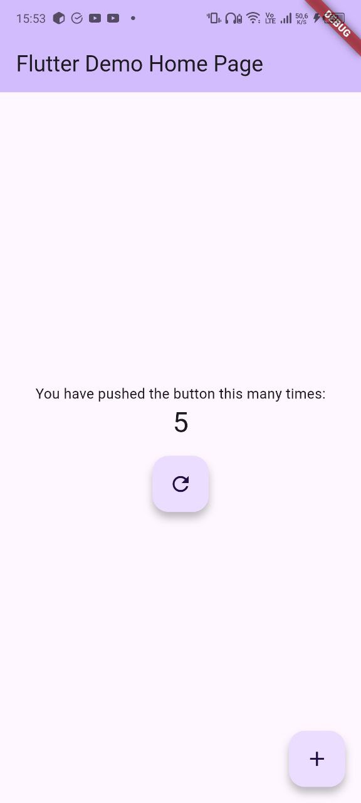
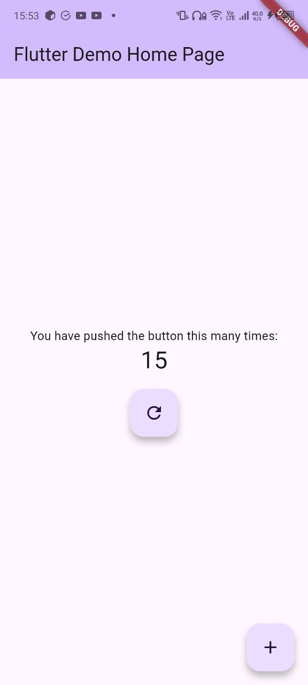
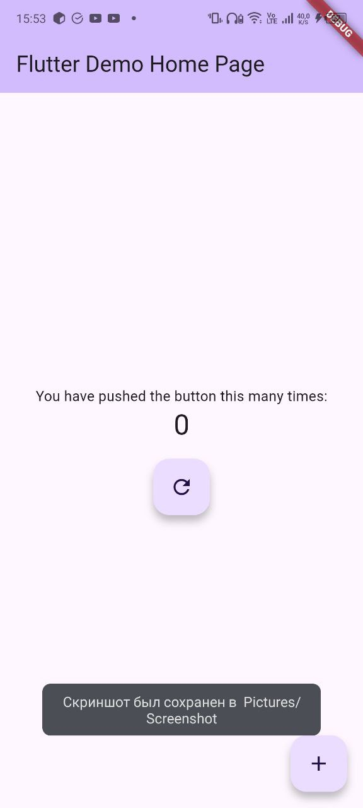

# Отчёт по практическому занятию №4

## Тема: Способы компоновки элементов, обработка событий и управление состоянием во Flutter

| Параметр | Значение |
| :--- | :--- |
| Студент | Устинов Максим |
| Группа | ЭФБО-09-23 |

---

## 1. Постановка задачи и используемые виджеты

Целью занятия было изучение основных способов компоновки элементов интерфейса, освоение работы с контейнерами и управление состоянием виджетов при нажатии кнопок.

В рамках работы реализован интерактивный счётчик, который обновляет своё значение при взаимодействии с кнопками.

### Основные использованные виджеты:
* Структура и компоновка:
    * Scaffold и AppBar для базовой структуры и заголовка «Практика №4».
    * Column для вертикального размещения элементов.
    * Center для центрирования содержимого в body.
    * Container, Padding, и SizedBox использованы для стилизации, задания фоновых цветов и создания отступов.
* Интерактивные элементы:
    * ElevatedButton (или аналоги) для кнопок «Увеличить» и «Сбросить».
    * Text для отображения текущего значения счётчика.

---

## 2. Обработка событий и управление состоянием

Для реализации динамического поведения счётчика использован класс `StatefulWidget`. Изменение интерфейса происходит благодаря методу `setState()`, который сигнализирует Flutter о необходимости перерисовки виджета после изменения внутренней переменной int counter = 0;.

### Реализованные события:
* Краткое нажатие (`onPressed`/`onTap`): Вызывает увеличение счётчика на +1.
* Сброс (`onPressed`): Устанавливает значение counter = 0.
* Долгое нажатие (`onLongPress`): При удержании кнопки счётчик увеличивается сразу на +10.

Пример реализации логики долгого нажатия:
```dart
void _onLongPress() {
  setState(() {
    _counter += 10;
  });
}
```

---

## 3. Демонстрация работы

1. Скриншот работающего приложения с кнопками и счетчиком.



---

2. Скриншот счётчика с увеличенным значением > 10.



---

3. Скриншот счётчика после сброса.

