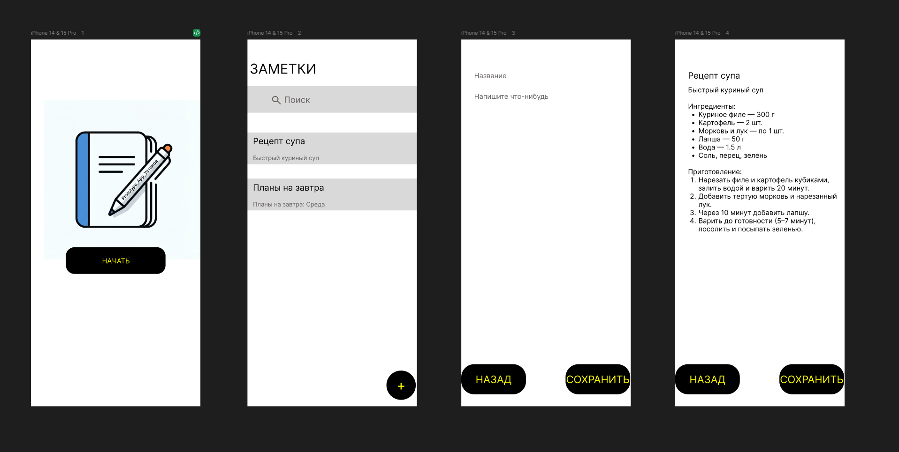
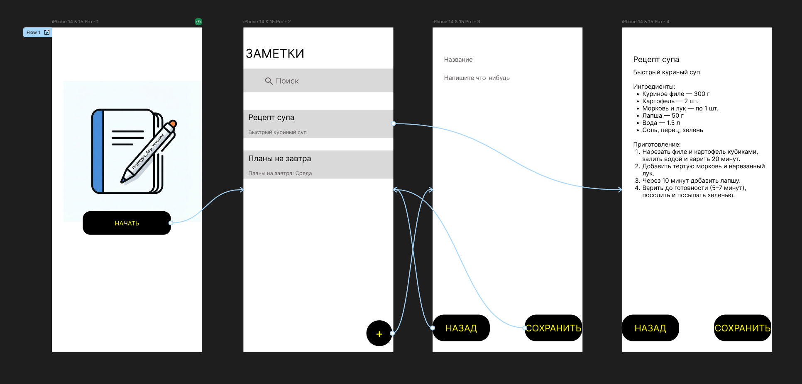
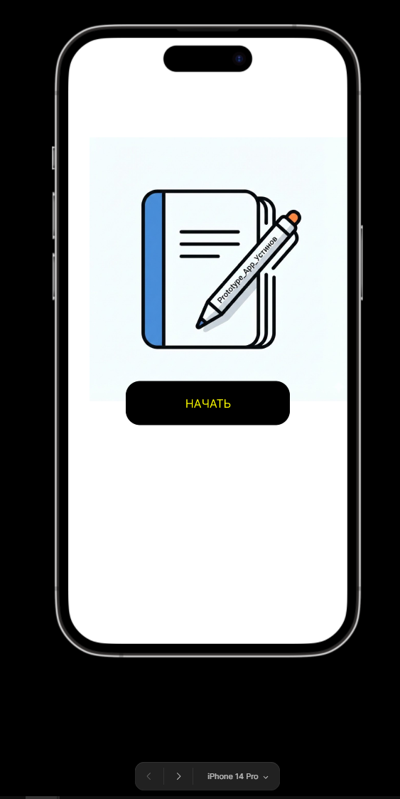
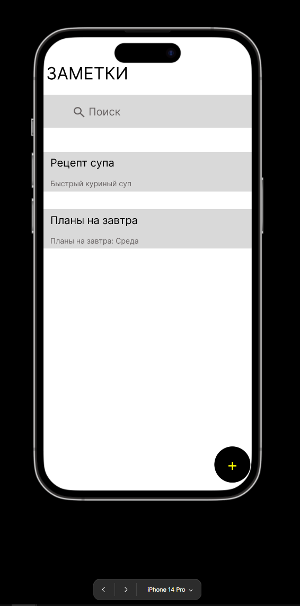
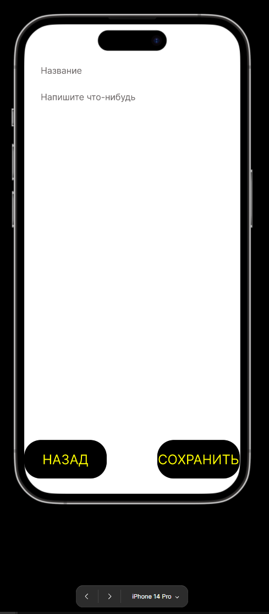
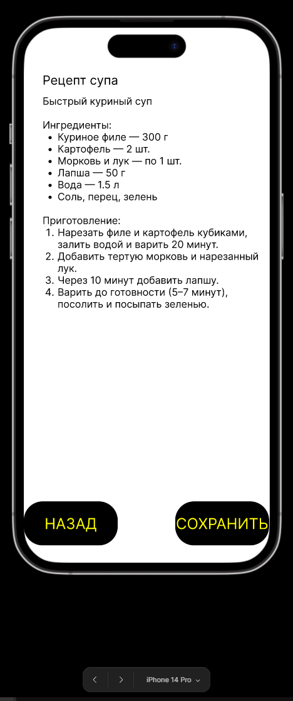

# Практика №2 Работа с макетами пользовательского интерфейса. Создание прототипа мобильного приложения.

## ЭФБО-09-23 Устинов Максим

Скриншот проекта в режиме Design

Скриншот в режиме Prototype

Скриншот в режиме Present

Были созданы экран приветствия, экран поиска заметки/экран выбора заметки/экран добавления заметки/, экран создания разметки, экран готовой заметки.

Использовались стандартные элементы Figma такие как прямоугольники, текст, стрелки навигации, иконки.

Навигация организована следующим образом:

1. Пользователь заходит на экран приветствия. На этом экране он видит кнопку "НАЧАТЬ". При нажатии этой кнопки он переходит на экран поиска заметки/экран выбора заметки/экран добавления заметки.

2. На данном экране пользователь видит все существующие заметки, а также может найти нужную с помощью виджета "поиск". Если нажать на заметку, то пользователь перейдет в нее и сможет ее отредактировать. Если нажать на "+", то пользователь сможет создать новую заметку.

3. На экране создания заметки пользователю доступны кнопки "НАЗАД" и "СОХРАНИТЬ". Нажимая кнопку "НАЗАД" пользователь перемещается на предыдущий экран. При нажатии кнопки "СОХРАНИТЬ" пользователь может сохранить свою заметку и его также перенаправит на предыдущий экран.

---

https://www.figma.com/design/lscSRkZbbmjIB0zXgwYkNJ/Protoype_App_%D0%A3%D1%81%D1%82%D0%B8%D0%BD%D0%BE%D0%B2?node-id=0-1&t=9MuNYZHFrf8Mmp3f-1

